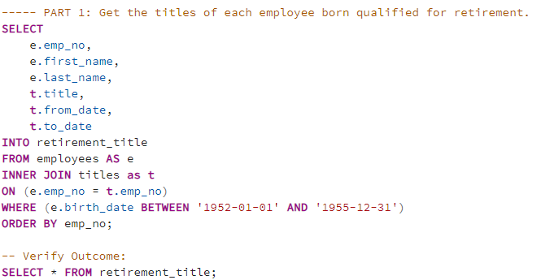
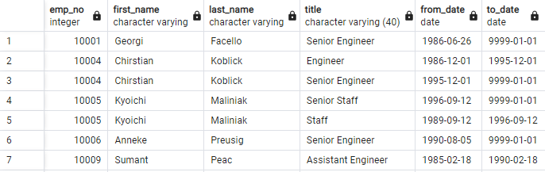
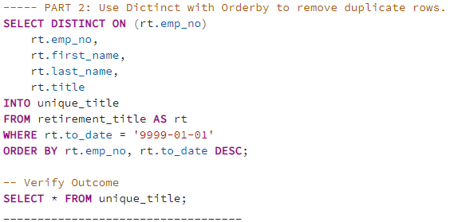
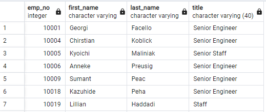
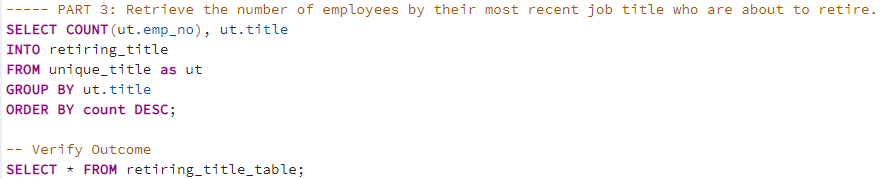
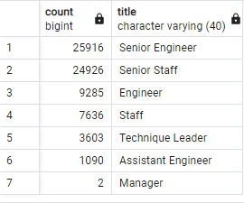
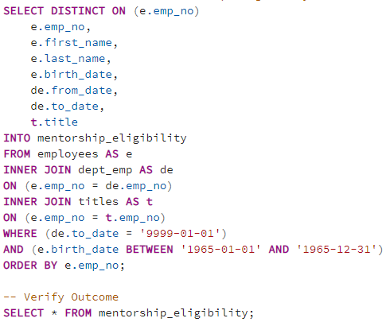
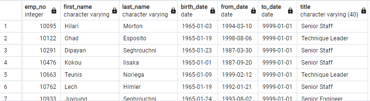
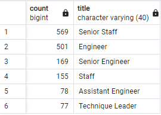

# Pewlett-Hackard-Analysis

## Overview of the analysis

Pewlett-Hackard (PH), a large technology company founded several years ago is facing a rapid retirement rate of its employees born in the mid sixties, also known as **"Baby Boomers"**.

Looking ahead, PH is offering a retirement package for its current employees who are born between 1952 and 1955. This mean that a large chunk of the company workforce will be reduced. Thus, a thorougful analysis is conducted to identify how what employees are retiring, what positions will need to be filled and what will be the impact of this retirement plan in the different departments of the company structure.

To mitigate the impact of the retirement plan, PH is additinally planning a mentoring program in which experienced and successful employees born in 1955 are eligible to step back into a part-time role instead of retiring completely. Their new role in the company would be as a mentor to the newly hired personnel.

In this module, we are required to apply data modeling, engineering and anlysis to the PH employee database, using *Structured Query Language*, also known as *SQL*.

Six input csv datasets are provided and were used to build the PH employee database:

1. **[Departments table](./Resources/departments.csv)**.
2. **[Employees table](./Resources/employees.csv)**.
3. **[Department-Employees table](./Resources/dept_emp.csv)**.
4. **[Department-Managers table](./Resources/dept_manager.csv)**.
5. **[Salaries table](./Resources/salaries.csv)**.
6. **[Titles table](./Resources/titles.csv)**.

The  shows the Entity Relational Diagram (ERD) of the six input datasets. It was created using *Quick Database Diagrams*. This diagram or database map, displays a visual representation of the content of each table in the database and the flow of data from one table to another.

## Results

Three final deliverable products and a **SQL** database query are provided as a results of this analysis:

**[Deliverable 1](./Analysis/retiring_titles.csv)**: The number of retiring employees by title.
**[Deliverable 2](./Analysis/mentorship_eligibility.csv)**: The Employees Eligible for the Mentorship Program
**[Deliverable 3](./README.md)**: A written report on the employee database analysis (This README.md file)
**[SQL Query](./Employee_Database_challenge.sql)**

### Deliverable 1

This deliverable consist of a table that holds the most recent title of all the current employees who are eligible for retirement.

A first query is written to merge the input tables *employees* and *titles*. The merge is performed based on employees who were born between 01/01/1952 and 12/31/1955. Finally, the table is sorted in ascending order by the employee number column. The outcome of this action is written and saved is a new table named *retirement_title.csv*

*Image 01: Deliverable 1, retirement_title table query.*

*Image 02: Deliverable 1, retirement_title table.*

It is observed duplicated entries in the retirement title table. This is because some employees switched position within the company throughout the years. Since we are interested in obtaining only their most recent position, we performed a new query where we filtered the table to obtain the most recent title from each employee. We also filtered the results using the *to_date* column to get only active employees.

*Image 03: Deliverable 1, unique_title table query.*

*Image 04: Deliverable 1, unique_title table.*

We obtained our final table by by counting the number of employees who are eligible for retirement by their title. The resulting table is then sorted in descending order based on the count of retiring personnel.

*Image 05: Deliverable 1, retiring_title table query.*

*Image 06: Deliverable 1, retiring_title table (final deliverable 1 table).*

### Deliverable 2

The second deliverable involves the creation of a mentorship-eligibility table that holds current employed personnel who were born specifically in 1965.

A single query is performed to merge the employee information in the *employees* table with the department information by employees contained in the *dept_emp* table and with the title information contained in the *titles* table. Employees who are no longer working in PH are discarded and the results are narrowed to discard personnel not born in 1965. The output mentorship_eligibility table is finally sorted in ascending order by the employee number column.

*Image 07: Deliverable 2, mentorship_eligibility table query.*

*Image 08: Deliverable 1, mentorship_eligibility table (final deliverable 2 table).*

## Summary

1. How many roles will need to be filled as the "silver tsunami" begins to make an impact?

A total of 72,458 vacant positions will need to be filled assuming a 100% retirement plan. However special attention will need to be paid to two departments: the development department with almost 26 thousand senior engineers and the human resources department with almost 25 thousand senior staff employees eligible for retirement.

2. Are there enough qualified, retirement-ready employees in the departments to mentor the next generation of Pewlett Hackard employees?

To respond this question, a count of the title of the mentorship-eligible personnel is displayed in a new table:

*Image 09: mentorship_eligibility titles table.*

A total of 1,549 employees are eligible for the mentorship-eligibility program. This amount of personnel would definitely help to mitigate the impact of losing a big amount of the company's workforce. However, there are only 169 eligible senior engineers for the mentorship program while almost 26 thousand senior engineers are eligible for retirementm this is perhaps the most critical aspect to be addressed before the “silver tsunami” makes impact.